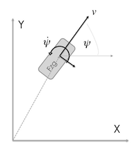

# 函数理解

## 问题1

三次样条插值,
需要保证任何情况下行驶300m内有以确保车辆行驶的安全。对于300m行驶距离，在高速道路最高限速120km/h的情况下，大约9秒的行驶时间。一旦组合导航系统失效和摄像头识别异常，高精度地图也可以提供最短9秒的安全接管时间。故我们在使用高精度地图车道线信息时，一般选取300m的车道线长度传给控制端，我们将300m区间[a,b]分成n个区间:[(x0,x1),(x1,x2),(x2,x3),,,(xn-1,xn)] ,共有n+1个点，暂时先不考虑数据量问题，我们把300的车道线作为大区间，其中两个端点 x0=1,xn=b ，每个车道线几何点作为小区间的两端点。
三次样条就是说每个小区间的曲线是一个三次方程，三次样条方程一般满足以下条件：
主要逻辑：

1. sLCFLaneData 初始化 0,1,2,3
    初始化车道线数据，包括曲率、标准差、有效长度等
2. fPosXPre[ii] 生成了一系列X坐标点，这些点均匀分布在0到50的范围内
3. 使用 TUE_CML_PosY3rd_M 函数根据每个X坐标点、最后的Y坐标（fLastY0[0]）、航向（fLastHeading[0]）、曲率（fLastCurvature[0]）和曲率变化率（fLastCurvatureRate[0]）来计算相应的Y坐标点
4.坐标变换:将一系列预测点（fPosXPre[ii], fPosYPre[ii]）旋转并平移，生成新的坐标集合（fPosXRot[ii], fPosYRot[ii]）。这里的旋转是基于车辆的偏航角变化（fDeltaYaw），使用三角函数（余弦和正弦）来计算新的X和Y坐标。然后，通过减去X和Y方向上的位移量（fDeltaPosX, fDeltaPosY），完成坐标的平移
5.初始化了多项式拟合输入结构 sPFTInput。它指定了要进行三阶多项式拟合（bEnable3rd = 1U），而不进行一阶和二阶拟合（bEnable1st 和 bEnable2nd 都设为 0）。这意味着算法将只考虑三阶多项式来拟合车道线。

### TUE_CML_PosY3rd_M

三个分支结构分别对应于一阶、二阶和三阶多项式拟合

一阶拟合：当 bEnable1st 为真时，执行一阶多项式拟合。它计算线性关系，并更新输出结构中的相关字段（如位置、航向和轨迹偏差）。如果拟合无效，相应字段设为零。

二阶拟合：当 bEnable2nd 为真时，执行二阶多项式拟合。这考虑了曲线的曲率，并更新输出结构中的相关字段（包括曲率）。若拟合无效，相应字段设为零。

三阶拟合：当 bEnable3rd 为真时，进行三阶多项式拟合。这考虑了曲率的变化率，并更新输出结构中的相关字段（包括曲率和曲率变化率）。若拟合无效，相应字段设为零。

### 其他

TUE_CML_CreateMatrix_M：用于创建一个矩阵
TUE_CML_GetMatrixElement_M：用于访问矩阵的特定元素
 getArcTanSmallAng：用于计算小角度的反正切值
## 问题2 

### lkfTrackManagement_predictInternalTrkbl

整体基于线性卡尔曼滤波器的方程进行实现

描述：
输入：float32 const f32PredictionDt  // 时间间隔
输出：uint32 u32Success // 变量累积各个函数的执行结果，以监测过程中是否出现错误。
执行逻辑：
1.定义状态标识 u32Success ，u16i，pCurrTrkbl
2.执行运行时错误检查 ，预测间隔检测 无效的输入，设置错误代码 u32Success 为 TUEOBJFUSN_ERROR_INVALID_INPUT 并调用 tue_prv_error_management_addError 函数来记录或处理这个错误
3.循环主体结构
    对不同的预测对象/ 同一个追踪对象的预测数量最大值
    TUEOBJFUSN_TRACKABLELIST_U16VALIDTRACKABLES_MAX
        条件检查 TUEOBJFUSN_TRACKABLE_U16LIFESPAN_FREE_SLOT
            依次执行 轨迹预测
            px,py,vx,vy,ax,ay
            LKF_DoPredict(pCurrTrkbl, f32PredictionDt)
            heading,yaw_rate
            LKF_CoordinatedTurn_DoPredict(pCurrTrkbl, f32PredictionDt);
            卡尔曼增益：通过理论预测值与实际测量值的加权线性组合来得到估计值
            gain_prediction(pCurrTrkbl, f32PredictionDt);

### LKF_DoPredict

描述：
输入：
输出：
主体逻辑：
    1.初始化 matQ,u32Success,
    f32dTSquared: 0.5t^2,
    f32dTpow2-5:t^2到t^5,
    f32PrefactorNoiseX,f32PrefactorNoiseY
    2.运行时错误检查的预处理指令
    3.根据对象的类别（pTrkbl->u16Class）来决定噪声系数的值 VEHICLE_UNKNOWN,2WHEELER_MOTORCYCLE,else
    4. 基于对象的状态维度（pTrkbl->vecX.nRows）来决定如何更新状态和初始化噪声矩阵（matQ）(表示系统过程中的不确定性)
        1）第一个分支（TRACKABLE_ACCY < pTrkbl->vecX.nRows）：当状态维度包含加速度（ACCX, ACCY）时，代码更新位置、速度和加速度，并对应地初始化噪声矩阵的多个元素。
        2）第二个分支（TRACKABLE_ACCX < pTrkbl->vecX.nRows）：当状态维度只包含X方向的加速度时，仅更新X方向的位置、速度和加速度，并对应地初始化噪声矩阵的一部分元素。
        3）最后一个分支：当状态维度不包含加速度时，仅更新位置和速度，并初始化噪声矩阵的一小部分
        具体每个分支内部步骤：
            a）更新对象状态：的x y 位置和速度:使用基本的运动学公式
            POS:位置 VEL:速度，ACC:加速度
            b）更新对象的协方差矩阵：
            px-px,vx-vx,ax-ax,py-py,vy-vy,ay-ay
            vx-px,vy-py,ax-px ay-py,vx-ax,vy-ay
        c) px-py,py-vx,px-vy,vx-vy,px-ax,vy-ax,px-ay,vx-ay,ax-ay 置0
    5.获取对应的 P = A * P * A' + Q ？
    LKF_PredictSymMat(&pTrkbl->matP, f32dT);
    f32SymMatAddSymMat(&matQ, &pTrkbl->matP, &pTrkbl->matP)

### LKF_CoordinatedTurn_DoPredict

描述：如果目标不是静止的，函数会根据航向和偏航率的方差来更新航向和角速度。最后，函数调整航向和偏航率的方差，确保它们在预定义的范围内.
偏航率是车辆从垂直轴旋转时的角速度。偏航率简单地表示车辆从其垂直轴旋转的程度，车辆向左或向右偏离其中心的角度有多远，或者车辆偏离其直线路线的程度。
输入：
输出：
主体逻辑：
    1.初始化 u32Success,
    f32Q_1_1,f32Q_1_2,f32Q_2_2
    f32HeadingYawRateCovar,
    f32Tmp：xy速度的平方和
    2.运行时错误检查的预处理指令=>输入参数的合法性
        指针检查，矩阵大小检查，矩阵尺寸一致性检查，状态数量检查，预测时间间隔检查。
    3.更新状态 航向，航向方差，偏航率方差
        新的航向=旧的航向+Δt×偏航率（yaw rate）
        将航向标准化到 [-π, π] 范围内
        航向方差新=航向方差旧+Δt×偏航率方差+其他项
        偏航率方差新=偏航率方差旧+过程噪声

